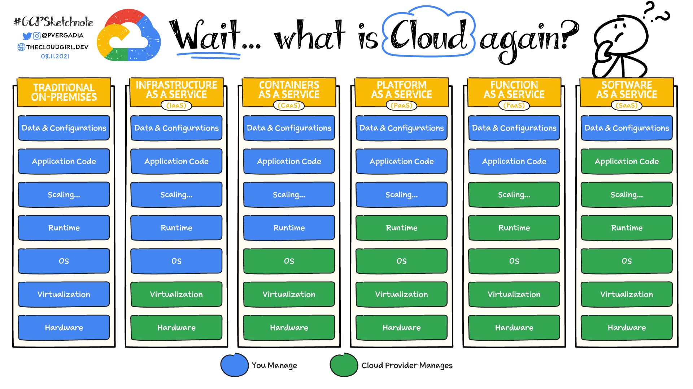

# Cloud

#### Best known providers

- Amazon Web Services
- Microsoft Azure
- Google Cloud

## Categories

"*As a service*" means that the service model is offered by third party in the cloud. Can pay a subscription or pay based on consumption (**pay-as-you-go**)

### On-Premises

Build your own data center.

### Infrastructure as a Service (IaaS)

Delivers infrastructure resources via the cloud, such as compute, storage, networking, and virtualization.

Customers are responsible for the OS, middleware, virtual machines, and any apps or data.

### Containers as a Service (CaaS)

Delivers and manages all the hardware and software resources to develop and deploy applications using containers. Sometimes viewed as a subset of **IaaS**, **CaaS** use containers rather than VMs as its main resource.

Customers are responsible to write the code and manage their data and apps, but the environment to build and deploy containerized app is managed by cloud service provider.

### Platform as a Service (IaaS)

Delivers and manages all the hardware and software resources.

Customers are responsible to write the code and manage their data and applications, but the environment to build and deploy apps is managed by the cloud service provider, needing the scaling configuration.

### Function as a Service (IaaS)

Customers are responsible to write the code that performs a specific task and manage their data and apps without worry with scaling.

### Software as a Service (IaaS)

Delivers an entire cloud-based application that customers can access and use. **SaaS** products are completely managed by the service provider.

Most **SaaS** applications are accessed through a web browser, requiring only the customer configuration.

## Pros X Cons

Service | Pros | Cons
-|-|-
IaaS|<ul><li>Highest level of control over infrastructure</li><li>No single point of failure for higher reliability</li><li>Fewer provisioning delays and wasted resources</li></ul>|<ul><li>Data security and recovery</li><li>Hands-on configuration</li></ul>
CaaS|<ul><li>Ideal for microservices</li><li>Control of networks and app components</li><li>Increases workload portability between environments (hybrid cloud and multicloud)</li><li>Built-in performance monitoring and container orchestration</li></ul>|<ul><li>Limited language support available</li><li>Containers security risks increase using the same kernel with the OS</li></ul>
PaaS|<ul><li>Instant access to a complete development platform</li><li>Availability anywhere</li></ul>|<ul><li>Application stack can be limited to the component</li><li>Vendor lock-in</li><li>Less control over operations and infrastructure</li></ul>
FaaS|<ul><li>Automatic Scalability</li><li>Uploads snippets</li><li>Decrease latency</li></ul>|<ul><li>Obstacles to test</li><li>Cold start</li><li>No control over infrasctructure or security</li></ul>
SaaS|<ul><li>Ready-to-go</li></ul>|<ul><li>Integration issues with existing apps</li><li>Little to no customization</li></ul>

---

