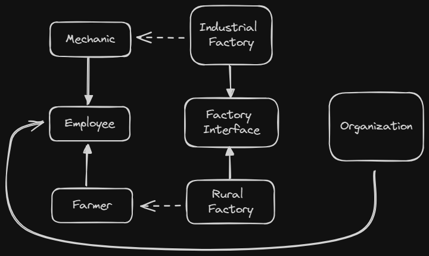
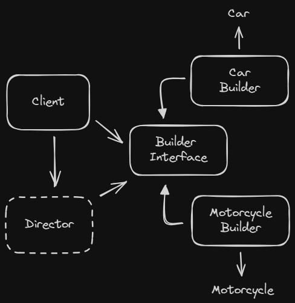

# Design Pattern

Typical solutions to common problems in software design.

The pattern is a general concept for solving a particular problem.

A pattern is not an algorithm. While an algorithm always defines a clear set of actions that can achieve some goal, a pattern is a more high-level description of a solution.

- Intent: describes the problem and solution
- Motivation: explains the problem and solution the pattern makes possible
- Structure: shows the classes in the pattern

##### GoF style

### Criticism

- Kludges for a weak programming language: patterns are workarounds for the lack of features in a programming language.

- Overkill: patterns are too complex for simple problems.

- Inefficiency: Many developers implement patterns without adapting to their projects.

#### Classification

- **Creational**: provide object creation mechanisms that increase flexibility and reuse of existing code.

- **Structural**: explains how to assemble objects, while keeping these structures flexible and efficient.

- **Behavioral**: focus on communication between objects.

---

# Creational

## Factory Method

Creating objects in a base class, allowing the subclasses alter the type of objects that will be created.

With this pattern, you can override the factory method in a subclass. The limitation is that the factory method will return different types of products only if these have a common base class.

### Applicability

When you don’t know beforehand the exact types and dependencies of the objects your code should work with

> The Factory Method separates product construction code from the code that actually uses the product.

When you want to provide users of your library or framework with a way to extend its internal components

> Inheritance is the easiest way to extend the default behavior of a library or framework. The solution is to reduce the code that constructs components into a single factory method and allow anyone to override this method in a subclass.

Reuse existing objects insted of rebuilding them each time.

> Create a regular method capable of creating new objects as well as reusing existing one.

### Pros and Cons

|Pros ✅|Cons❗|
|-|-|
| Single Responsibility Principle. | The number of different subclasses. |
| *Open/Closed Principle.* ||

---

## Abstract Factory

Produces families of related objects without specifying their concrete classes.

The needed to create individual objects to match other objects in the same family. Without change existing code and core classes.

### Structure

- Abstract Objects: declares interfaces for a set of distinct but related family of products.

- Concrete Objects: implements the interfaces declared by the abstract objects.

- Abstract Factory: declares an interface for operations that create abstract products.

- Concrete Factory: implement creation methods of the abstract factory.

- The client uses only interfaces declared by the abstract factory and abstract objects.

### Applicability

Use when code needs to work with various families of related products.

Implements this pattern when you have a class with a set of factory methods that blur its primary responsibility.

### Pros and Cons

|Pros ✅|Cons❗|
|-|-|
| Compatibility with each other products | Complexity is growing by number of new interfaces |
| *Single Responsibility Principle.* ||
| *Open/Closed Principle.* ||

---

## Builder

Create complex objects step by step. Allows to produce different types of an object using the same construction code.

Solve the problem of many fields in a class constructor, or scattered in client code. The simple way is to create many subclasses, or define parameters to set all attributes of possibilities.

The approach of Builder is to extract the object construction code out of its own class and move it to separate objects called builders.

The pattern organize in methods (buildA, buildB, buildC) to create a complex object step by step, without calling all steps.

But the client only can use the builders with a Director, that defines the order of steps choosed by client, where the builder provides the result object.

The director is optional, but it is useful when the client needs to create the same product using the same steps.

### Structure

- Builder interface: create the common methods of all builders.

- Concrete Builders: implement the builder interface and provide specific implementations of the building steps.

- Product: Don't have to belong to the same call hierarchy.

- Director: responsible for the construction process.

- The client associates one of the builders with the director and initiates the construction process.

### Applicability

Use the Builder pattern to get rid of a “telescoping constructor”

Use when you want your code to create different representations of some object, differentiating the building process in details.

Use to construct complex objects. Preventing the client to access unfinished objects.

### Pros and Cons

|Pros ✅|Cons❗|
|-|-|
| Reuse constructions | Complexity increase by number of new classes |
| *Single Responsibility Principle* ||

---

## Prototype

Can create a copy of an object without coupling to its class.

### Structure

### Applicability

### Pros and Cons
