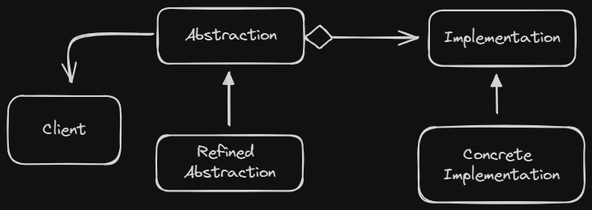
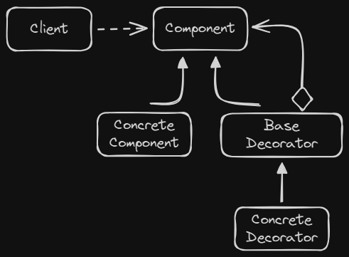
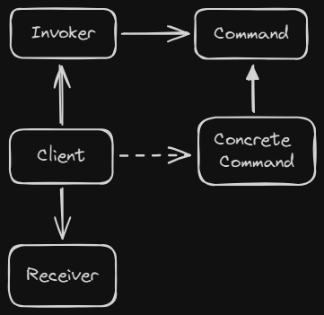

# Design Pattern

Typical solutions to common problems in software design.

The pattern is a general concept for solving a particular problem.

A pattern is not an algorithm. While an algorithm always defines a clear set of actions that can achieve some goal, a pattern is a more high-level description of a solution.

- Intent: describes the problem and solution
- Motivation: explains the problem and solution the pattern makes possible
- Structure: shows the classes in the pattern

##### GoF style

### Criticism

- Kludges for a weak programming language: patterns are workarounds for the lack of features in a programming language.

- Overkill: patterns are too complex for simple problems.

- Inefficiency: Many developers implement patterns without adapting to their projects.

#### Classification

- **Creational**: provide object creation mechanisms that increase flexibility and reuse of existing code.

- **Structural**: explains how to assemble objects, while keeping these structures flexible and efficient.

- **Behavioral**: focus on communication between objects.

---

# Creational

## Factory Method

Creating objects in a base class, allowing the subclasses alter the type of objects that will be created.

With this pattern, you can override the factory method in a subclass. The limitation is that the factory method will return different types of products only if these have a common base class.

### Applicability

When you don’t know beforehand the exact types and dependencies of the objects your code should work with

> The Factory Method separates product construction code from the code that actually uses the product.

When you want to provide users of your library or framework with a way to extend its internal components

> Inheritance is the easiest way to extend the default behavior of a library or framework. The solution is to reduce the code that constructs components into a single factory method and allow anyone to override this method in a subclass.

Reuse existing objects insted of rebuilding them each time.

> Create a regular method capable of creating new objects as well as reusing existing one.

### Pros and Cons

|Pros ✅|Cons❗|
|-|-|
| Single Responsibility Principle. | The number of different subclasses. |
| *Open/Closed Principle.* ||

---

## Abstract Factory

Produces families of related objects without specifying their concrete classes.

The needed to create individual objects to match other objects in the same family. Without change existing code and core classes.

### Structure

- Abstract Objects: declares interfaces for a set of distinct but related family of products.

- Concrete Objects: implements the interfaces declared by the abstract objects.

- Abstract Factory: declares an interface for operations that create abstract products.

- Concrete Factory: implement creation methods of the abstract factory.

- The client uses only interfaces declared by the abstract factory and abstract objects.


### Applicability

Use when code needs to work with various families of related products.

Implements this pattern when you have a class with a set of factory methods that blur its primary responsibility.

### Pros and Cons

|Pros ✅|Cons❗|
|-|-|
| Compatibility with each other products | Complexity is growing by number of new interfaces |
| *Single Responsibility Principle.* ||
| *Open/Closed Principle.* ||

---

## Builder

Create complex objects step by step. Allows to produce different types of an object using the same construction code.

Solve the problem of many fields in a class constructor, or scattered in client code. The simple way is to create many subclasses, or define parameters to set all attributes of possibilities.

The approach of Builder is to extract the object construction code out of its own class and move it to separate objects called builders.

The pattern organize in methods (buildA, buildB, buildC) to create a complex object step by step, without calling all steps.

But the client only can use the builders with a Director, that defines the order of steps choosed by client, where the builder provides the result object.

The director is optional, but it is useful when the client needs to create the same product using the same steps.

### Structure

- Builder interface: create the common methods of all builders.

- Concrete Builders: implement the builder interface and provide specific implementations of the building steps.

- Product: Don't have to belong to the same call hierarchy.

- Director: responsible for the construction process.

- The client associates one of the builders with the director and initiates the construction process.


### Applicability

Use the Builder pattern to get rid of a “telescoping constructor”

Use when you want your code to create different representations of some object, differentiating the building process in details.

Use to construct complex objects. Preventing the client to access unfinished objects.

### Pros and Cons

|Pros ✅|Cons❗|
|-|-|
| Reuse constructions | Complexity increase by number of new classes |
| *Single Responsibility Principle* ||

---

## Prototype

Can create a copy of an object without coupling to its class.

Not all object's fields can be copied. The object must have a method to copy itself. And the need to know the class of the object you create a dependency.

The prototype pattern delegates a cloning method in the common interface. The clone method create an object of current class and copy all fields. Not based in inheritance.

Optionally, create a centralized prototype registry to store a catalog of frequently used prototypes.

### Applicability

Use the pattern when your code don't depend on concrete classes of objects that you need to copy.

Use when you want to reduce the number of subclasses that only differ in initialization.

### Pros and Cons

|Pros ✅|Cons❗|
|-|-|
| Discard repeated initialization code | Objects with circular dependencies |
| Create complex objects conveniently ||

---

## Singleton

*Abstract Factories*, *Builders*, and *Prototypes* can be implemented as *Singletons*.

Ensure that a class has only one instance and provide a global point of access to it.

Violating the *Single Responsability Principle*, the singleton objects are used in the entire application (most used in critical contexts, to access databases or files), with only one instance of it.

The default constructor is private, preventing use the ```new``` operator. Create a static method to call the private constructor and control the access with static field of the same object.

### Applicability

Use Singleton when a class in your program should have just a single instance available to all clients.

In oder hand of global variables, the Singleton pattern guarantees that there’s just one instance of a class. And you can define the number of distinct instances.

### Pros and Cons

|Pros ✅|Cons❗|
|-|-|
| Ensure that a class has only one instance | Violates the Single Responsability Principle |
| You gain a global access point to that instance | Can mask bad design |
|  | Need a treatment in *multithread* environment |
|  | May be difficult to create unit tests |

---

# Structural

## Adapter / Wrapper

An adapter wraps an object to hide the conversion of its interface.

Adapters can not only convert differents types, but also can help with the communication between objects with different interfaces.

### Structure

This implementation uses the object composition principle or can use inheritance of both interfaces of Client and Service.

- Client contains the business logic.

- The Client interface describes the Client’s interaction with the adapter.

- The Service is some useful class, incompatible with the client code.

- The Adapter implements the Client interface and composes the Service object. Receiving calls from the client, the adapter translates them into calls to the service object.

- You can introduce others types in Adapter without breaking the Client.

### Applicability

Use when your existing class isn't compatible with the rest of your code.

Use this pattern when you want to reuse several existing subclasses that lack some common functionality that can't be added to the superclass.

### Pros and Cons

|Pros ✅|Cons❗|
|-|-|
| *Single Responsibility Principle* | The number of interfaces increase |
| *Open/Closed Principle* |  |

---

## Bridge

Lets you split a large class or a set of closely related classes into two separate hierarchies — abstraction and implementation.

The Bridge pattern switch from inheritance to composition. So that the original classes will reference the new hierarchy, instead of having all of its states.

#### Abstraction and Implementation

**Abstraction (Interface)** defines the high-level logic, delegating the work to the **Implementation** layer (**Platform**).

### Structure

- The *Abstraction* provides high-level control logic.

- The *Implementation* declares the interface that's common for all concrete implementations.

- The abstraction may list the same methods as the implementation

- *Concrete Implementations* contain platform-specific code

- Refined Abstractions: provide variants of control logic.

- The *Client* works with the Abstraction and defines the Implementation linked to it.



### Applicability

When you want to divide and organize a monolithic class that has several variants of some functionality.

Use the Bridge pattern when you need to extend a class in several orthogonal (independent) dimensions.

If you need to switch implementations at runtime.

### Pros and Cons

|Pros ✅|Cons❗|
|-|-|
| *Single Responsibility Principle* | You can complicate by forcing this pattern in a cohesive class |
| *Open/Closed Principle* |  |
| Create Platform-Independent classes |  |

---

## Composite / Object Tree

This pattern lets you compose objects into tree structures to represent part-whole hierarchies.

For this approach, you create a common interface for all objects in the hierarchy. And the client treats all objects in the hierarchy uniformly.

If you call some method in the root object, it will pass the request down the tree, letting all the objects in the hierarchy carry out the same operation.

### Structure

- The *Component* declares the common interface for all complex or simple components.

- The *Leaf* represents the simple components of the composition. It doesn't have children.

- The *Container / Composite* represents the complex components that may have sub-elements: containers or leaves. It works with children through the component interface.

- The *Client* works with all components through the component interface.

### Applicability

Use the Composite pattern when you want the client code to treat both simple and complex elements uniformly.

### Pros and Cons

|Pros ✅|Cons❗|
|-|-|
| Let you work with complex tree structures conveniently | Difficult to create a common interface for classes whose differs in functionality |
| *Open/Closed Principle* | Violate the *Interface Segregation Principle* by create the leaves add/remove method empty |

---

## Decorator / Wrapper

This pattern lets you attach new behaviors to objects by placing these objects inside special wrapper objects that contain the new behaviors.

Extending a class is the first thing that comes to mind when you need to alter an object’s behavior. But inheritance has its limitations.

> Inheritance is static. You can’t alter the behavior of an existing object at runtime.

Creating a new class for each possible combination of features would be messy.

With this approach, you can wrap an object in multiple decorators. The wrapper contains the same set of methods. However, the wrapper may do something before or after it passes the request to the target.

The client can decorate the object with any custom decorators, as long as they follow the same interface as the others.

### Structure

- The *Component* declares the common interface for both wrappers and wrapped objects.

- *Concrete Component* is a class of objects being wrapped.

- *Base Decorator* has a wrapper member field and implements the Component interface.

- The *Concrete Decorator* contains the wrapped object and adds its own behavior.



### Applicalibility

When you need to assign extra behaviors to objects at runtime.

|Pros ✅|Cons❗|
|-|-|
| New behaviors without subclasses | It's hard to remove a specific wrapper from the wrapper stack |
| *Single Responsibility Principle* | Dependency of order of behaviors from decorators stack |

---

## Facade

A facade is a class that provides a simple interface to a complex subsystem. It's more simple than the subsystem interface, but only those features that clients need.

You create a facade when you need to integrate with a complex library but only want to use feel functionalities.

### Structure

- The *Facade* provides a simple interface to the complex logic of one or several subsystems.

- The *Subsystems* contain the complex logic of the system. They are independent of the facade and can be used directly by clients. And you need to know how them works, initializing in order and supplying the correct parameters.

- And the *Client* uses the facade to communicate with the subsystems.

### Applicability

Use the Facade when you want to structure a subsystem into layers.

|Pros ✅|Cons❗|
|-|-|
| Isolated from subsystem complexity | A facade can become a god object |

---

## Flyweight / Cache

This pattern lets you fit more objects into the available RAM by sharing common parts of multiple objects, instead of keeping object separately.

You can extract the main attributes to a super class that contains the *intrinsic state*. And the subclasses contain the *extrinsic state*.

A Flyweight object must be immutable. It should receive all the required state once via the constructor.

For management, you can use a factory method to accept the intrinsic state of the desire flyweight, while looks for an existing object, if not, it creates and add to the pool.

The method can be stored at a container, a new factory class or as a static method in the flyweight class.

### Structure

- The *Flyweight* contains the intrinsic state that is shared between multiple objects.

- The *Context* contains the extrinsic state that is unique to each object.

- The *Flyweight Factory* manages the pool of flyweights. It creates and returns the flyweight, or returns an existing one.

- The *Client* calculates or stores the extrinsic state of flyweights.

### Applicability

Use when you have a large number of similar objects that consume a lot of RAM.

|Pros ✅|Cons❗|
|-|-|
| Save RAM | The code become more complex |

---

## Proxy

Provides a substitute or placeholder for control access to another object.

The proxy has the same interface as the real object, so the client can work with the proxy as if it were the real object.

With this pattern, you can do something before or after the request is passed to the real object.

In legacy code you may need to make proxy as a subclass of the service class.

### Structure

- The *Service Interface* declares the interface of the Service and the Proxy.

- The *Service* is a class that provides some useful business logic.

- The *Proxy* has a reference to the Service and implements the same interface. It controls the access to the Service with lazy initialization, logging, access control, caching, etc.

### Applicability

Lazy initialization (virtual proxy). When you only need the big object service from time to time;

Access control (protection proxy). When you want to check if the client has the credentials;

Local execution of a remote service (remote proxy);

Logging requests (logging proxy). Keep a log of the requests to the service;

Caching request results (caching proxy);

Smart reference. When you need to dimiss a heavyweight object when it's not used checking in clients.

|Pros ✅|Cons❗|
|-|-|
| Manage the lifecycle of the service | Performance in service's responses |
| Proxy works even if service is not ready |  |
| *Open/Closed Principle* |  |

---

# Behavioral

## Chain of Responsibility (CoR) / Chain of Command

You can pass a request along handlers. Each handler decides whether to process the request or pass it along the chain.

The pattern suggests that you link several handlers into a chain, like a linked-list. When the client sends a request, it’s passed along the chain until every handler decide to process or decline the request.

> a chain can always be extracted from an object tree.

### Structure

- Create a *Handler Interface* with a single method, and optional to add a reference to the next handler.

- The *Base Handler* is an optional class to serve as boilerplate code for concrete handlers.

- The *Concrete Handlers* contain the actual code to process the request. Handlers acceppt all necessary data just once via the constructor.

- The *Client* compose chains, being able to sent a request to **any** handler.

### Applicability

Use when the program is expected to process different kinds of requests in various ways.

When it's essential to execute several handlers in a particular order.

Use the CoR pattern when the set of handlers and their order are supposed to change at runtime.

|Pros ✅|Cons❗|
|-|-|
| Control the order of request | Some requests end up unhandled |
| *Single Responsibility Principle.* ||
| *Open/Closed Principle* ||

---

## Command / Action / Transaction

This patter turns requests into objects, allowing to parameterize clients with queues, delays, and operations.

Good software design is often based on the principle of **separation of concerns**, which usually results in breaking an app into layers.

The Command pattern suggests that you separate a request for an operation from the object that actually performs the operation. With the object being called, method, and parameters. Sending afterwards to the invoker.

### Structure

- The *Invoker* (sender) initiate the request. It stores the command object and triggers the command.

- The *Command* interface declares a execution method.

- The *Concrete Command* pass the call to one of the business logic objects. It contains the receiver object, the method, and the parameters.

- The *Receiver* contains some business logic.

- The *Client* creates the command object and associates to one or multiple sernders.



### Applicability

When you want to parameterize objects with operations.

When you want to queue operations, schedule their execution, or execute them remotely.

When you want to implement reversible operations.

|Pros ✅|Cons❗|
|-|-|
| *Single Responsibility Principle.* | More complexity including another layer to the app |
| *Open/Closed Principle* ||
| Can implement undo/redo ||
| Assemble simple commands into a complex one ||
| Remote executions ||

---

## Iterator

Lets you traverse elements of a collection without exposing its underlying representation.

The main ideia is to extract the traversal behavior of a collection into a separate object.

An iterator object encapsulates all of the traversal details, the current position, how many left, etc.

The interface defines the next and hasMore methods.

### Appliability

When your collection has a complex data structure under the hood, hiding from client.

Reduce duplication of the traversal code across your app

When you want to provide a single interface for traversing different collections.

|Pros ✅|Cons❗|
|-|-|
| *Single Responsibility Principle.* | Overkill to simple collections |
| *Open/Closed Principle* | May be less efficient than use the collection logic |
| Iterates in parallel with multiple kinds ||
| Can delay the iteration ||

---

## Mediator / Controller / Intermediary

The Mediator pattern lets you reduce the dependencies between objects.

The suggest is to cease all direct communication between the components to collaborate by calling a mediator that redirect the call to others appropriate objects.

> The fewer dependencies a class has, the easier it becomes to modify, extend or reuse that class.

### Structure

- *Components* are varios classes that contains business logic. Each have a reference to mediator.

- The *Mediator Interface* declares methods of communication with components.

- *Concrete Mediator* encapsulate the relations between varios components, kepping the reference.

### Appliability

Use the Mediator when it's hard to change a class because they are coupled to some others classes.

When you can't reuse a component in different program because of it's dependencies in anothers.

|Pros ✅|Cons❗|
|-|-|
| *Single Responsibility Principle.* | Over time a mediator can evolve into a God Object |
| *Open/Closed Principle* ||
| Reuse components easily ||

---

## Memento / Snapshot

This pattern saves and restore the previous state of objects without revealing the details of its implementation.

> [!WARNING]
> How to make a copy of the object’s private state?

| Private: can't copy | Public: unsafe |
|-|-|

This patthern solve the problem that other classes would become dependent on every little change to the snapshot class.

Memento delegate creating the state snapshot to the actual *originator* object, instead an object trying to copy from the outside. And stores the states in a *memento* object.

The *caretaker* manages with this storage using a limited interface.

### Structure

- The *Originator* can produce snapshots as well as restore its state from snapshots.

- The *Memento* is a value immutable object tha acts as a snapshot of the originator's state.

- The *Caretaker* knows when and why capture the state, and when restores it.

### Applicability

Use the Memento when you want to restore the previous object's state. (undo / transactions)

|Pros ✅|Cons❗|
|-|-|
| Produce snapshots without violating the encapsulation | The app can consume lots of RAM |
|  | Dynamic programming languages can't guarantee that the state of memento stays untoutched |

---

## Observer / Event-Subscriber / Listener

This pattern lets you define a subscription method to notify multiple objects about any events that happen to the observed.

It's works with *subjects*, some *publishers* and some *subscribers* .

With this pattern the publisher have a subscription mechanism - an array storing the references of subscriber objects and public methods to add and remove those objects.

The number of subscribers is not relevant, if all subscribers implement the same interface with the notification method.

### Structure

- The **Publisher** issues events when change its state. Having the subscription infrastructure, don't coupling in the type since those implements the same interface.

- The **Subscriber Interface** declares the notification interface - an ```update``` method with contextual parameters.

- The **Concrete Subscriber** perform some action with the issues.

- The **Client** creates publisher and subscriber objects.

### Applicability

Use the Observer pattern when changes to the state of one object may require changing other objects.

|Pros ✅|Cons❗|
|-|-|
| *Open/Closed Principle* | Subscribers are notified in random order. |
| Estabilish relations between objects in runtime |  |

---

## State

State pattern let an object change its behavior when its internal state alters.

The pattern is like a *Finite-State Machine*. Where the program has a finite number of states and have particular behaviors when achive each. But the *transitions* are also limited by the current state.

To solve the problem of monstrous switches, the suggestion is to create a class of all possible states, extracting the behavior.

To transition the context, replace the active state object.

> The interface may mirror all the methods declared in the context class.

### Structure

- **Context** stores a reference to the current state object, communicating by the **State Interface**. And expose a setter to change the state.

- The **State Interface** declares the methods.

- The **Concrete State** implements the behavior of the state. To avoid duplication, you can create intermediate abstract classes that encapsulate commom behavior (State objects may store a backreference to the context object).

- Both **Context** and **State** can set the next **State**.

### Applicability

When you have an object that behaves differently depending on its current state, the number of states is enormous, and the state-specific code changes frequently.

Use the pattern when you have a massive conditional operator that selects the behavior according to the current object’s state.

When you have a lot of duplicate code across similar states and transitions of a condition-based state machine.

|Pros ✅|Cons❗|
|-|-|
| *Open/Closed Principle* | Can be an overkill with few states |
| *Single Responsibility Principle.* |  |
| Simplify the code |  |

---

## Strategy

Lets you define a family of algorithms, put each of them into a separate class, and make their objects interchangeable.

The pattern suggests that you extract the varying behavior into separate classes called *strategies*. Referenced in the *context* class.

The client defines the strategy and passes it to the context. The context, in turn, calls the algorithm defined in the strategy interface.

> Strategy works on the object level, letting you switch behaviors at runtime.

### Structure

- The **Context** contains a reference to the strategy object and delegates it some work.

- The **Strategy Interface** declares the common method for all concrete strategies.

- **Concrete Strategies** implement different variations of an algorithm.

- The **Client** creates the context object and sets the strategy chosen.

### Applicability

When you want to use different variants of an algorithm within an object and switch from one algorithm to another during *runtime*.

When you have similar classes that only differ in the way they execute some behavior.

Use to isolate the business logic of a class from the implementation details of algorithms.

When you have a massive conditional statement that selects the desired variant of the same algorithm.

|Pros ✅|Cons❗|
|-|-|
| *Open/Closed Principle* | Don't need strategies when you have few algorithms and changes rarely |
| Can change the algorithm in runtime | Clients must be aware of differences between strategies |
| Isolate business details from the code that use it | Can use anonymous functions without create extra classes and interfaces |

---

## Template Method

In this pattern you define the structure of an algorithm in a base class, but let subclasses override specific steps of the algorithm.

The pattern suggests that you break down an algorithm into a series of steps, turn these steps into methods, and put a series of calls to these methods inside a single *template method*. The steps may be ```abstract```.

The client need to provide its own subclass, implement the abstract methods, and override some if needed.

*Optional steps* already have some default implementation, but still can be overridden if needed.

Usually, **hooks** are empty body optional methods placed before and after crucial steps of algorithms, providing subclasses with additional extension points for an algorithm.

> Template Method works at the class level, so it’s static

### Structure

- The **Abstract Class** contains the template method and abstract methods.

- **Concrete Classes** implements the abstract methods and overrides the optional ones.

### Applicability

Use the Template Method pattern when you want to let clients extend only particular steps of an algorithm, but not the whole algorithm or its structure.

When you have several classes that contain almost identical algorithms with some minor differences.

|Pros ✅|Cons❗|
|-|-|
| Can pull the duplicate code into a superclass | Violate the *Liskov Substitution Principle* |
|  | Tend to be harder to maintain the more steps its have |

---

## Visitor

This pattern lets you separate algorithms from the objects on which they operate.

Its suggests that you place the new behavior into a separate class called *visitor*, instead of trying to integrate it into existing classes. The original object is passed to the visitor's methods as an argument.

The **Visitor** uses the *Double Dispatch* technique, where the object accepts the visitor and calls the visitor's method with itself as an argument.

> Double Dispatch is a mechanism that allows the visitor to call a method that is specific to the object it works with.

```
// Client code
foreach (Node node in graph)
    node.accept(Visitor)

class Foo is
    method accept(Visitor v) is
        v.doForFoo(this)

class Bar is
    method accept(Visitor v) is
        v.doForBar(this)
```

### Structure

- The **Visitor Interface** declares a set of visiting methods that correspond to the classes of the visited elements.

- **Concrete Visitors** implement the visiting methods for specific classes of elements.

- The **Element Interface** declares a method for "accepting" visitors.

- **Concrete Elements** implement the "accept" method. The purpose of this method is to redirect the call to the proper visiting method to the current element class.

- The **Client** usually represents a collection or some other complex object.

### Applicability

When you need to perform an operation on all elements of a complex object structure.

Clean up the business logic of auxiliary behaviors.

|Pros ✅|Cons❗|
|-|-|
| *Open/Closed Principle* | Need to update all visitors when a class is added or removed |
| *Single Responsability Principle* | Visitors might lack the access to private fields and methods of the elements working with |

---