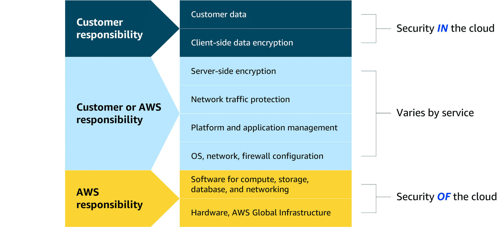

# Module 1 - Introduction to the Cloud

### What is cloud computing?

AWS computing was formed from the necessity of having a more flexible and scalable computing environment to deploy its ecommerce.

> On-demand delivery of IT resources over the internet with pay-as-you-go pricing.

#### Cloud deployment types

- Cloud: Migrate all resources to the cloud, design and build apps in cloud. First migrate the data then develop an app comprised of virtual servers, databases and networks.

- On-premises: Deploying using virtualization and resource management tools to manage resources in your own data center. This deployment type is often used for legacy applications or when data residency is a concern, to try increasing resource utilization.

- Hybrid: cloud-based and on-premises resources working together. This is often used to gradually migrate to the cloud or to keep sensitive data on-premises while using cloud resources for other workloads.

### Benefits

- Variable expense
- Automatic scalability based in the traffic
- Increase speed and agility
- Globalized

#### Availability Zones (AZ)

Distributed power, networking and connectivity in different regions;

- **High availability**: Affordable application with minimal downtime
- **Fault tolerance**: Keep the application up if multiple services fail

#### Shared Responsibility Model

Both the customer and AWS are responsible for the security of the service.

The AWS is responsible for the security of the cloud.

The customer is responsible for the security in the cloud.

