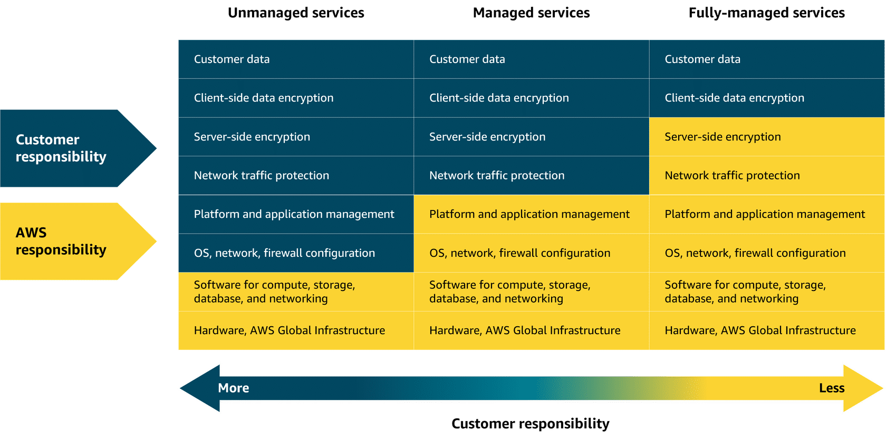

# Module 3 - Exploring Compute Services

## Unmanaged Services

Unmanaged services such as EC2, AWS takes care of the underlying physical infrastructure, but the customer is responsible for setting up, securing, and maintaining the OS, network configurations, and applications on your instance.

## Managed Services

Managed services reduce the amount of infrastructure the customer need to manage. While the AWS handles much of the operational overhead, the customer might still need to perform some provisioning or configuration.

## Serverless

You cannot see or access the underlying infrastructure.

## AWS Lambda

Function as a Service

Runs code in response to events without the need to provision or manage servers. Scaling resources based on the volume of requests.

Charged only for the compute time consumed.

Lambda handles execution scaling, and resource allocation.

## Containers and Orchestration

Run containers in EC2, customer managing or, run on AWS Fargate (serverless) only concerned about the container.

### Amazon Elastic Container Service (ECS)

- Streamlined and integrated;

- Define some parameters;

- Fully managed service;

### Amazon Elastic Kubernetes Service (EKS)

- Open Source platform;

- More complex;

- More control and flexibility;

### Amazon Elastic Container Registry (ECR)

- Fully managed Docker registry;

- Stores container images;

- Follow the **Open Container Initiative** (OCI);

---

1. Upload a container image to ECR;
2. Choose an orchestration service (ECS or EKS);
3. Select which compute platform to run your container (EC2 or Fargate);

## VM ✕ Containers

VMs runs OS separately from host, using hypervisor. Containers are faster and lighter because they share the host OS.

## Compute Services +

#### Elastic Beanstalk

- Simplified provisioning;

- Configuration management;

- Visibility and control;

*Good for*: Deploying and managing web applications, RESTful APIs, among others, with automated scaling and simplified infrastructure management.

#### Batch

- Infrastructure management;

- Parallel processing support;

- Automatic scaling;

*Good for*: Processing large-scale, parallel workloads.

#### Lightsail

- Simplicity;

- Cost-effective solution;

- Managed infrastructure;

- VPS, storage, databases, and networking;

*Good for*: Basic web application, low-traffic websites, development and testing environments, and learning cloud services.

#### Outposts

- Hybrid cloud solution (extends to on-premise);

- Consistent environments;

- Low latency and data residency;

*Good for*: Low-latency applications, data processing in remote locations, migrating and modernizing legacy apps.